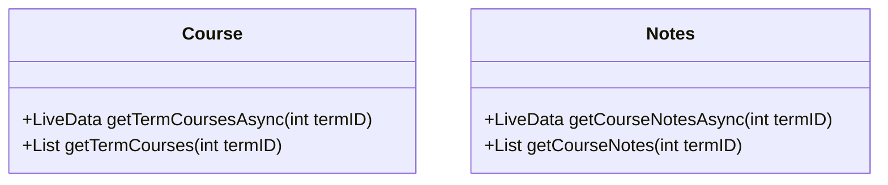
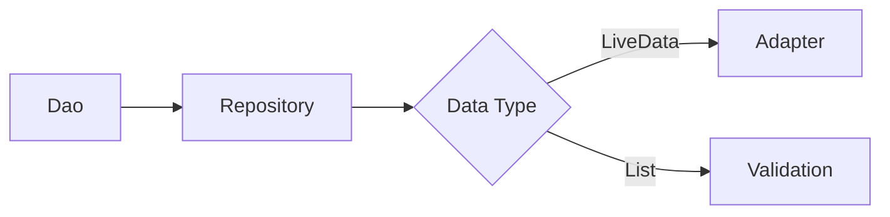

# Reflection

**name**: _Tyler Yeager_
**id**: #001003911
**class**: Mobile Application Development – C196

[toc]

## Mobile Application Development

```
Operating System: Linux Mint 19.3  
minSdkVersion 26  
targetSdkVersion 29  
```
Utilizing Androids Room framework demonstrates a focus on database development when building a application. Interacting with the unusual requirements of a mobile device requires attention to an app lifecycle, including the possibility of being terminated by the device’s memory control, orientation changes, and a greater focus on asynchronous programming. Android has a focus on MVVO (Model View ViewModel) to address many of the issues stated above. Requiring the usage of an emulator or physical android device requires the ability to develop in one environment (desktop), for another environment (android). This resulted in design changes to address problems such as a smaller screen and expectation of a single activity per purpose.
Difficulties during development
I found difficulty with where to start the project. Initially, I began a top-down development, where I was building the GUI. However, this led to roadblocks almost immediately. Initially, addressing issues such as maintaining the integrity of content of each page by ensuring data was not lost in the lifecycle (e.g during orientation changes).
Then, programming with asynchronous data became a roadblock multiple times during development as well, as it would often require an argument (such as a term id) to return the correct entities. Later, checking the size of a result was difficult, as asynchronous data does not have a size until it is checked. This made it difficult to ensure a term had no courses associated with it.
Thirdly, radio buttons were considered a string initially, but this rapidly became a problem with  getting, setting and storing of the different options.
Finally, alarms was conceptually difficult to understand, as it uses a service provided by Android, requiring that I register an alarm and hope it would activate correctly. As I worked through the project, I was able to address many of these issues.

## Overcoming each challenge
Developing bottom up, by identifying the database design and implementing the required methods I would need was much easier to develop for. By using `LiveData`, I addressed problems such as the life-cycle of data on a GUI screen by always using the database for data. Information left on screen could be tossed out without loss and did not require additional complexity to maintain the state of the activity.
GUI was developed to meet the needs of the database, which meant that insufficient layouts could be tossed out rather then making critical database design changes. One database change that had to occur however was for radio buttons, which was changed to an int and provided with getting and setting methods to identify what a status integer related to, `0 == Dropped` for example.
I was unable to overcome the challenge of asynchronous data and checking its size, and resorted to implementing an entirely different call to the database to return synced data, allowing the app to identify the size of it and determine if a term has courses associated with it.

## Different Approach
My different approach would include creating the storyboard from the beginning as this would decrease wasted time from creating GUI layouts that ended up being unused. A bottom-up approach and setting the foundation for the GUI would speed up development.
Given a firmer understanding of asynchronous operations and its limitations, I would have attempted to predict any requirements that might need to be solved by using synchronous calls.
For example, in the school scheduler project, the current approach assumed that no calls to the database required a synchronous call and only needed data as requested. I would restructure the database to allow calls to be synchronous or asynchronous.




Displaying live data is the most common usage, and most of the project would continue to utilize live data.
However, validation checks (such as ensuring courses cannot be deleted with notes attached, or courses associated with a term) would utilize this.
Calling the data this way, makes numerous changes up the abstraction layers.


By doing this, validation checks on the data would be easier to handle, remove complexity of trying to *force* `LiveData` to act as `Lists` and improve optimization, as synchronous called would only be completed when needed.

## Emulator Usage
Emulators are a tool to rapidly develop programs by allowing the developer to load in a apk into many simulated environments, such as tablets, phones or even wearable devices such as watches.
The pro behind this is easy to see; a developer is not required to purchase a large variety of devices to test their software and see how it would function under normal usage. Additional features, such as root access or easily attaching debuggers allow examining databases or specific calls without requiring much setup. The risk of failure, possibly corrupting or damaging the phone is minimized as well.
On the other hand, while emulators simulate many characteristic of physical devices, they do not simulate everything. Desktop computers generally have stable, unlimited usage and high speed Internet connections. Phones however, are often metered, lose connection frequently and have slow connection speeds.
Physical devices may demonstrate unexpected quirks, such as unreliable blue-tooth connections, or unexpected battery usage that would not be identified in a emulator and as such, not addressed.